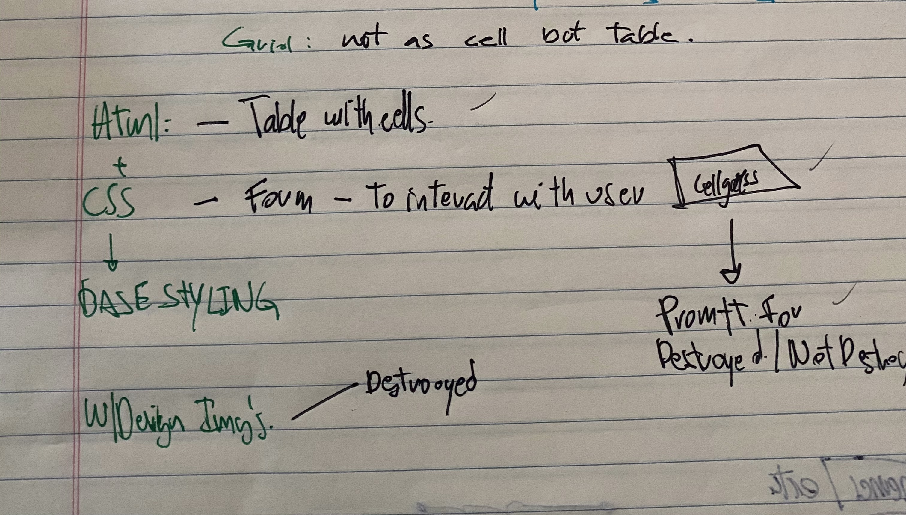
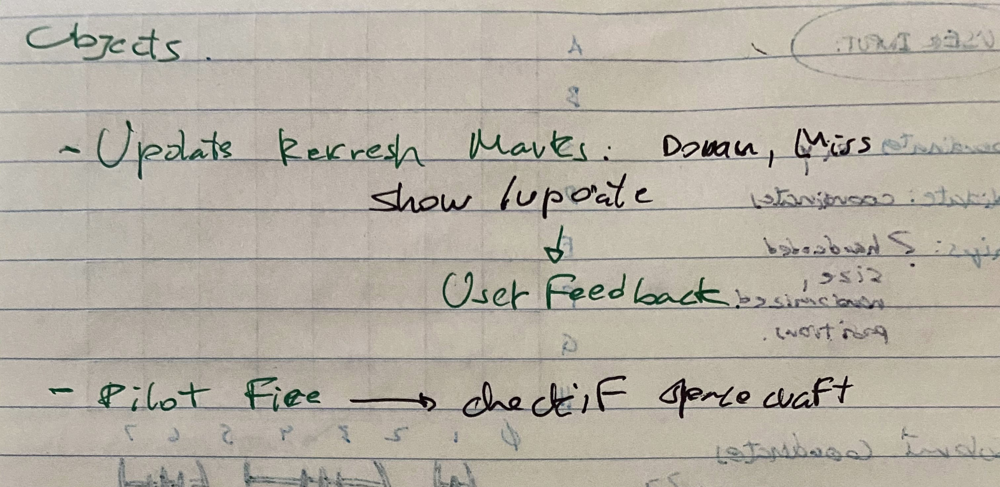

# Zim against the universe

## What is Zim against the universe?

Zim is trying finally conquer not only earth but the universe... reason why u know, worlds are trying to fight back. Problem is that the threat tracking device was developed by Zim fueld by passion, gir took care of graphics and i lended some help with the logic, reason why the system is precise on destruction but won't tell you where the threats are. Your mission is to guess based on knowing the story line, where the attacking devices are located, take them down, and out of existance!

I choose to make this game, as i find for my thought process it's hard to have that visual/logical mix while developing, reason why i branched out of my initial proposal into something i have a clearer idea of where this 2 worlds mix.

Plus, Zim is HxCx!

## Technical Discussion

I'll be using a mix HTML, CSS, JavaScript.

### Notes on Game Structure

- Learning DOM manipulation and key codes.
- Having a better understanding of object oriented programming
- Keeping a mental map of variables.
- The secret powers of ADHD
- The secret curses of ADHD

## The Making of Zim against the universe

- The RSO for keepin' me sane.
- DxTr! - Jay - Pete - Mike
- The Class Crew
- Long Beach fair swell this past friday before class!
- lost's Puddle Jumpers shred even in ankle biters!
- Google - Youtube.
- JavaScript & Jquery by Jon Duckett.
- Html & Css by Jon Duckett.

## Opportunities for Future Growth

- Live Hit Counter.
- Different Ship Sizes Randomized.
- User Name added.
- Sounds.
- Better imaging.
