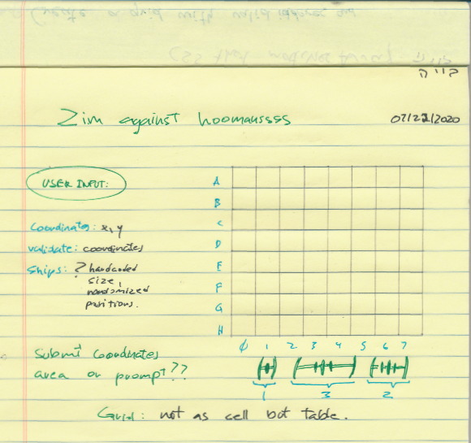

*** Name / Date ***

# Zim against the universe - Proposal

## What is Zim against the universe?

Zim is trying finally conquer not only earth but the universe... reason why u know, worlds are trying to fight back. Problem is that the threat tracking device was developed by Zim fueld by passion, gir took care of graphics and i lended some help with the logic, reason why the system is precise on destruction but won't tell you where the threats are. 
Your mission is to guess based on knowing the story line, where the attacking devices are located, take them down, and out of existance!

## Wireframe

## Initial thoughts on game structure

(Write out what challenges you expect to encounter, or ideas you want to come up with)
- Logic
- User Input of coordinates, how? when? And how to make the environment render visually but work logically (this is my biggest wall)
- Popups or graphical response for destroyed / wasted ammo
- Game logic  - If guessed right, threat down.
                - If the threat occupies multiple cells, keep shooting
              - Once threats are down, reset.

## Phases of Completion

(The steps or phases you expect to go through, and the tasks that you'll need to accomplish to reach each step. These should resemble the acceptance criteria we were working through earlier.)

WhiteBoard :

   - Elements
   - Logic
   - Conditions of gameFlow
   - Tools used on each step
   - Research

NotePad : i use a lot of drafting, drawings, and color codes, i have a yellow and white notepad, one is for drafting and brainstorming, learned resources, and the white one is for my pre/during/post core.

## Links and Resources

- Google is your best friend.
- Youtube
- GA Master Jedi's brainsssss.
